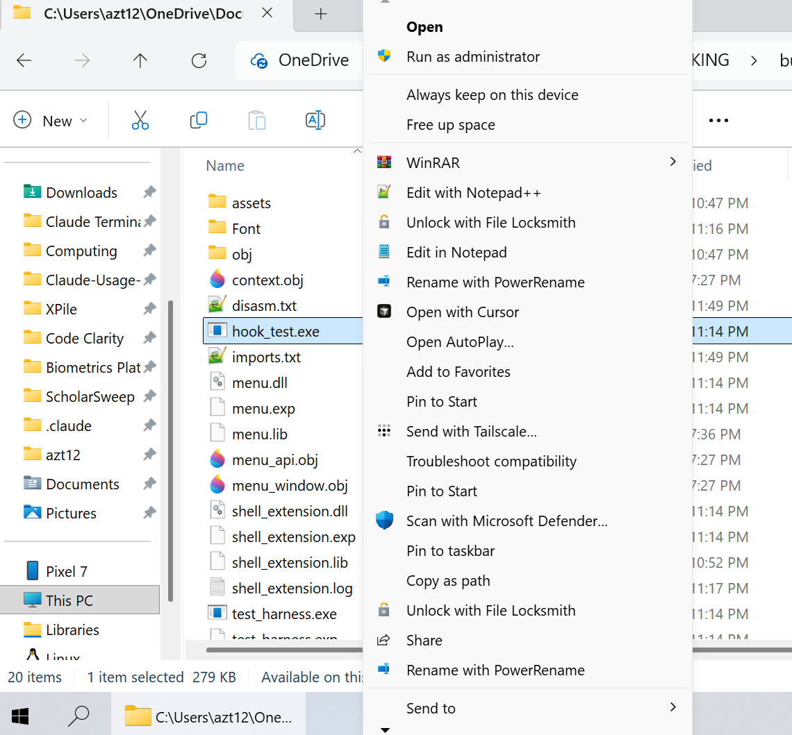
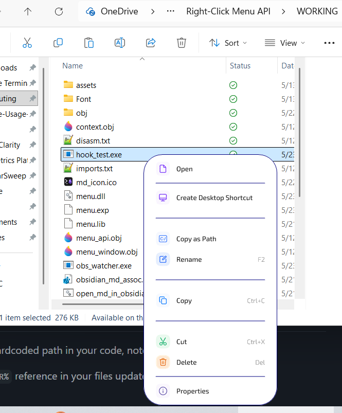

# Custom Right-Click Menu

Windows 11 24H2 shell-extension DLL that **replaces** File Explorer's right-click context menu with a custom owner-drawn menu defined declaratively by a consumer DLL. No "Show more options" submenu nonsense, no slow modern menu, no Microsoft layout — your menu is the menu.

## Before / After

| Before | After |
|---|---|
|  |  |

## What it does

- Inline-patches `user32!TrackPopupMenuEx` in `explorer.exe` so every right-click that would have shown Windows' menu goes through this DLL instead.
- Calls a consumer-supplied `RegisterMenu()` function that builds the menu declaratively using `Selection(...)`, `Submenu(...)`, and `Separator()` macros.
- Paints the menu itself using a per-pixel-alpha layered window (GDI+ shapes + D2D/DirectWrite text composited through a private WIC bitmap) — variable-height rows, rounded corners, navy outline, Exo 2 variable font, smooth animations.
- Extracts the right-click context (selected files, current folder, modifiers, click coordinates) and exposes it to the consumer as globals: `target`, `path`, `paths`, `parentFolder`, `extension`, `selectionCount`, `modifiers`, `clickLocation`.
- Dispatches the consumer's click-handler lambda under SEH so a consumer crash degrades to no-menu rather than crashing Explorer.
- **Multi-tab Explorer**: reads selection + folder from the right-clicked tab's own `SHELLDLL_DefView` via UIAutomation, working around the Win11 24H2 cabinet-wide `IShellBrowser` being permanently anchored to the original tab.

## Repository layout

```
Custom-Right-Click-Menu/
├── src/                  Host DLL — 20 .cpp/.h files
│   ├── main.cpp                DllMain + COM exports + SEH-wrapped consumer entry
│   ├── menu_api.{h,cpp}        Macro tree builder + click-handler registry
│   ├── menu_node.h             MenuNode + handler-registry decls
│   ├── menu_window.{h,cpp}     Owner-drawn rendering, hit-test, modal loop
│   ├── hook.{h,cpp}            IAT + inline patch on TrackPopupMenuEx
│   ├── detours_hook.{h,cpp}    CoCreateInstance IAT hook (modern-menu suppression)
│   ├── class_factory.{h,cpp}   IClassFactory + no-op IContextMenu stub
│   ├── context.{h,cpp}         Context-global storage + predicates
│   ├── shell_context.{h,cpp}   Per-tab IShellBrowser + UIA selection extraction
│   ├── folder_view_actions.{h,cpp}  View / Sort by / Group by via IFolderView2
│   ├── diag.{h,cpp}            File logger
│   └── shell_extension.def     COM exports
├── examples/menu.cpp     Consumer DLL — sample menu definition + action helpers
├── obs_watcher/          SetWinEventHook-based .md temp-vault cleanup helper
├── hook_test/            Stage-2 hook-pipeline test exe
├── test_harness/         Stage-1 direct-call test exe
├── open_md_launcher/     .md double-click handler (PS-source + native exe)
├── test_scripts/         Python utilities (extract_icons.py, etc.)
├── assets/icons/         22 menu icons (56×56 transparent PNG)
├── Font/                 Exo 2 variable-axis TTF
├── build.bat             One-shot cl.exe build of all five artifacts
├── register.bat          regsvr32 wrapper (admin) — Stage 3 install
├── unregister.bat        regsvr32 /u wrapper
└── Docs/                 Generated codebase docs (Quick Guide, File Tree, Reference)
```

## Build

Requires:
- Windows 11 24H2 x64
- Visual Studio 2022 Build Tools with MSVC v143
- Python 3 + Pillow + numpy (only for `test_scripts/extract_icons.py`, optional)

From an **x64 Native Tools Command Prompt for VS 2022** in the repo root:

```cmd
build.bat
```

Build order matters because `menu.dll` links against `build\shell_extension.lib`. Order: `test_harness.exe` → `shell_extension.dll` → `menu.dll` → `hook_test.exe` → `obs_watcher.exe`. Robocopy steps mirror `assets/icons/` and the Exo 2 font into `build/`.

## Install

From an x64 Native Tools Command Prompt (admin):

```cmd
register.bat
taskkill /F /IM explorer.exe && start explorer.exe
```

Two steps. `register.bat` runs `regsvr32` on `build\shell_extension.dll` to add the CLSID + ContextMenuHandlers registry entries. The Explorer restart is **mandatory** — Explorer only loads the DLL when a new instance launches, so registration alone doesn't surface the menu until next login. Killing + restarting Explorer makes it appear immediately.

Right-click anywhere in File Explorer afterward.

To remove: `unregister.bat` (admin), then restart Explorer.

## Customize the menu

Edit `examples/menu.cpp` and rebuild `menu.dll`. The consumer API is one header (`src/menu_api.h`) with three macros:

```cpp
extern "C" void RegisterMenu() {
    if (target == ClickTarget::File) {
        Selection(L"Open in Obsidian", L"", L"open.png") {
            OpenInObsidianFlow(path);
        };
        Submenu(L"More") {
            Selection(L"Copy as Path") { CopyAsPathViaShell(path); };
            Selection(L"Open Terminal Here") { OpenTerminalAtAsAdmin(parentFolder); };
        };
        Separator();
        Selection(L"Delete", L"Del") { SendKeys(VK_DELETE); };
    }
    // ... branches for Folder, MultiSelection, DirectoryBackground, etc.
}
```

Context globals available inside any handler:

| Global | Type | Meaning |
|---|---|---|
| `target` | `ClickTarget` | File / Folder / Drive / DirectoryBackground / MultiSelection / VirtualItem |
| `path` | `std::wstring` | Single-target convenience |
| `paths` | `std::vector<std::wstring>` | Multi-selection |
| `parentFolder` | `std::wstring` | Folder containing the click target |
| `extension` | `std::wstring` | File extension including the dot |
| `selectionCount` | `int` | |
| `modifiers` | `int` | Bitmask of Shift / Ctrl / Alt / Win |
| `clickLocation` | `POINT` | Screen coords of the click |

Predicates: `extension_exists({L".md", L".txt"})`, `path_matches(L"*\\Downloads\\*")`.

Folder-view actions for DirectoryBackground menus: `set_view_mode(ViewMode::Details)`, `set_sort_by(SortKey::DateModified)`, `set_group_by(GroupKey::Type)`.

## Architectural invariants (do not violate)

1. **The host process never crashes because of us.** Every shell boundary is SEH-wrapped: `DllMain`, both TPM detours, `dispatch_handler`, `build_menu_for_current_click`. A consumer fault degrades to no-menu, never to an Explorer crash.
2. **Inline hook is the actual interception.** 12-byte `mov rax, imm64; jmp rax` patch at `user32!TrackPopupMenuEx`'s entry. IAT hooks remain as defense-in-depth.
3. **Per-tab data is read via UIA on SHELLDLL_DefView** (not the cabinet's IShellBrowser). On Win11 24H2 the cabinet IShellBrowser is permanently anchored to the original tab and never refreshes — UIA on the per-tab DefView is the only working path.
4. **Three-mode export attribute (`MENU_API_DECL`)** switches between static link / dllexport / dllimport. Without it the consumer can't share state with the host.
5. **Per-pixel-alpha layered window.** `WS_EX_LAYERED` + `UpdateLayeredWindow(ULW_ALPHA)`. No `DwmSetWindowAttribute`. No `CS_DROPSHADOW`.
6. **Text via D2D + DirectWrite into a private WIC bitmap** composited back source-over. GDI+ text on a layered DIB renders chiseled.
7. **Click-through dismissal.** 25 ms poll timer → `DestroyWindow` + synthetic `SendInput` re-injection at the cursor so the underlying window receives the click.
8. **Shift + RightClick** lifts the inline hook entirely and falls through to Explorer's legacy menu. Manual escape hatch when you want the original menu.

## Known limitations

- Custom menu is for built-in shell context only — not third-party shell extensions that draw their own popups.
- Modern-menu CLSID suppression is best-effort; the actual CLSIDs Win11 24H2 uses for the modern menu are not all known (`src/detours_hook.cpp::kRefusedClsids` has placeholders for now).
- DPI scaling is hardcoded to 1.0 (`menu_window.cpp::show_impl`). On hi-DPI displays icons render at literal 28 physical pixels.
- "Pin to Start" was removed from the menu — no in-process path exists on Win11 24H2 build 26200 to write to Start's Pinned grid. `IPinnedList3` returns `E_NOINTERFACE`; `start2.bin` is fully encrypted.
- No code signing. SmartScreen / WDAC may silently block registration on a stock machine.

## Status

Tested live on Windows 11 Pro 24H2 (Insider Dev build 26200). All Stage-3 paths verified including multi-tab right-click on non-original tabs (a 24H2-specific edge that required UIA-direct reading).

## License

MIT.
